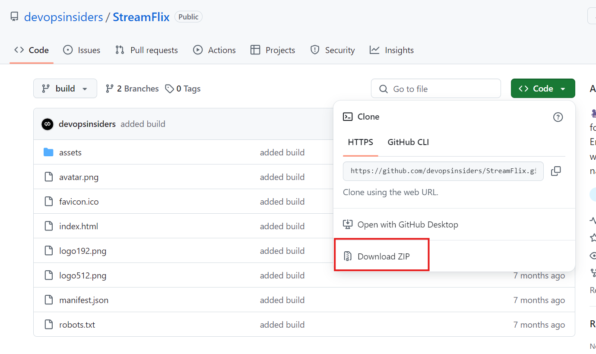
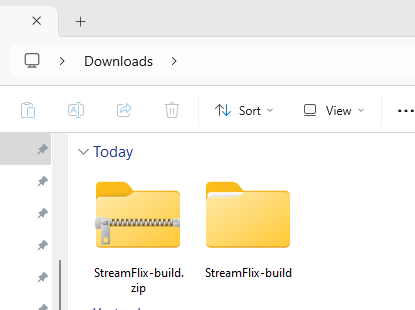

# Step 1: Install IIS Web Server

1. **Open the Windows Features Dialog:**
   - Press `Windows Key + R` to open the **Run** dialog.
   - Type `optionalfeatures` and press Enter to open the **Windows Features** window.

2. **Enable IIS:**
   - In the "Windows Features" dialog, locate and check the following:
     - **Internet Information Services (images/iIS)**
     - **Web Management Tools** (Ensure **IIS Management Console** is checked)
     - **World Wide Web Services**
     - **Application Development Features** (Check **ASP.NET**, **.NET Extensibility**, **ISAPI Extensions**, **ISAPI Filters**)
     - **Security** (Ensure **Request Filtering** is checked)
   - After checking the required options, click **OK** to install IIS.

3. **Verify IIS Installation:**
   - Open a web browser and go to `http://localhost`. You should see the default IIS welcome page if IIS is installed correctly.

# Step 2: Install the StreamFlix (Netflix Clone) Application

1. **Download the StreamFlix Code:**
   - Go to the [StreamFlix GitHub repository](https://github.com/devopsinsiders/StreamFlix).
   - Click the **Code** button, then select **Download ZIP**.

2. **Extract the Code:**
   - Once the ZIP file is downloaded, extract the contents to a folder on your computer.

3. **Copy the StreamFlix Code to IIS Default Folder:**
   - Navigate to the IIS default web folder located at `C:\inetpub\wwwroot`.
   - **Copy** all the extracted files from the `StreamFlix` folder directly into the `C:\inetpub\wwwroot` folder. Do not create any subfolders.

### Step 3: Access the Application

1. **Access the Application in a Browser:**
   - Open a web browser and visit `http://localhost/`.
   - You should now see the homepage of the **StreamFlix** application or the Netflix clone interface.

